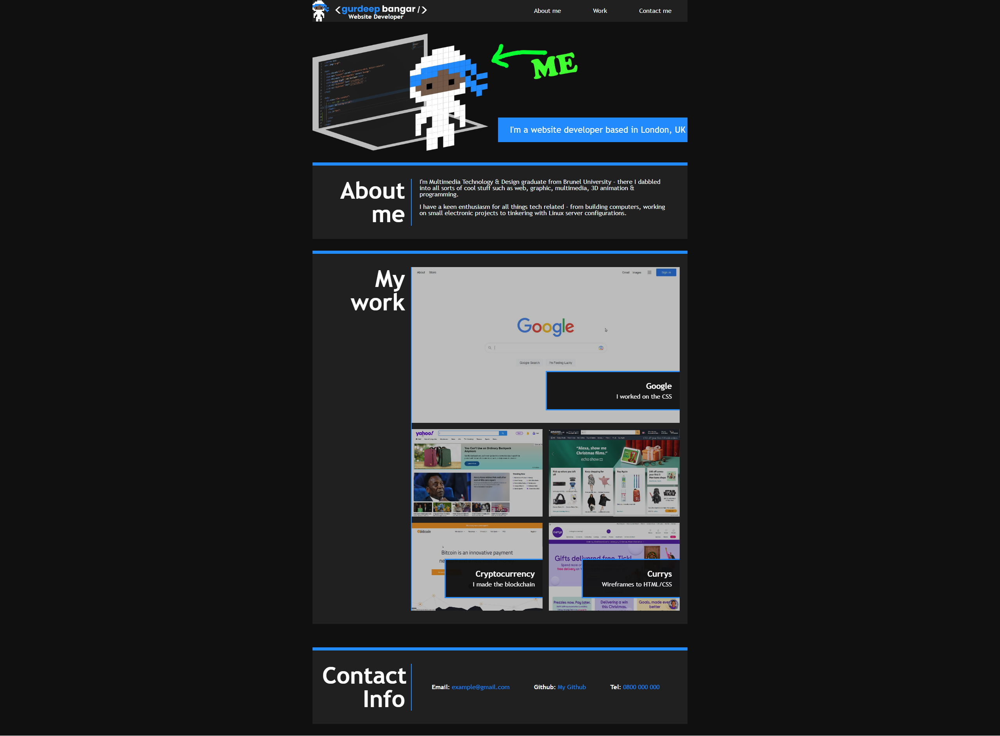

# Challenge - Portfolio Website

## Description

A portfolio website created showcasing what has been learnt so far in the coding bootcamp - CSS Flexbox, Media queries & variables were used throughout the creation of this portfolio.

This portfolio is responsive for mobile, tablet & desktop devices.

[View deployed website on Github Pages](https://gurdeep-ninja.github.io/portfolio/)

## Installation

Simply clone or download this project as a zip file & extract to your websites root directory.

## Technologies
 